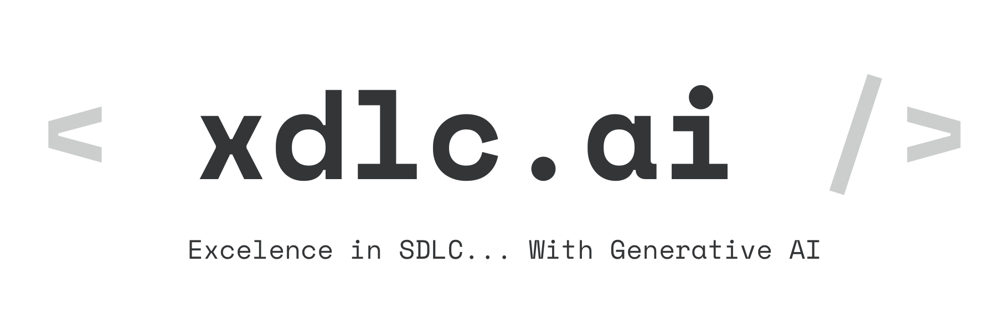

Welcome to the xdlc.ai Blog!

In the ever-evolving landscape of software engineering, Generative AI has emerged as a transformative force. As highlighted in our [Manifesto](./#manifesto), the industry has seen a surge in AI tools, with GitHub Copilot leading the charge. The [2024 Stackoverflow Survey](https://survey.stackoverflow.co/2024/ai#sentiment-and-usage-ai-select) reveals that a significant majority of developers are embracing these tools, yet challenges remain in fully leveraging their potential.

<!-- truncate -->

At < xdlc.ai />, we are a collective of passionate software development professionals dedicated to exploring the future of software engineering. Our mission is to share insights, evidence, and recommendations to help you maximize the benefits of Generative AI in your development processes. Our experiences span real production projects, offering a unique perspective on the practical application of AI beyond simple coding tasks.

In our [Lessons Learned](./docs/Lessons-learned) document, we delve into the real-world impact of integrating AI tools into the Software Development Life Cycle (SDLC). From boosting productivity within existing teams to addressing human factors in AI adoption, we provide a comprehensive analysis of the promises and realities of Gen AI in SDLC.

Our [LLM Leaderboard](./llms) offers a detailed ranking of Large Language Models, essential components of AI coding assistants. Choosing the right model can be challenging, and our evaluations aim to guide you in making informed decisions.

Similarly, our [Coding Assistants Leaderboard](./coding-assistants) evaluates various AI-driven tools designed to enhance software development. These tools are assessed across multiple categories, ensuring you have the latest insights into their performance and capabilities.

We invite you to join us in navigating the complexities of AI tools, making informed decisions, and integrating them effectively into your SDLC. Together, we can overcome the challenges and pursue excellence in software development with Generative AI.

Thank you for visiting our blog, and we look forward to sharing this journey with you!

